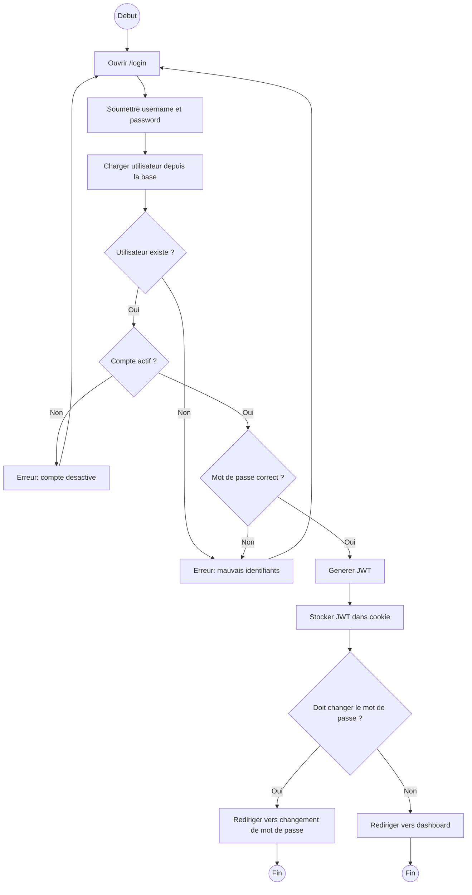
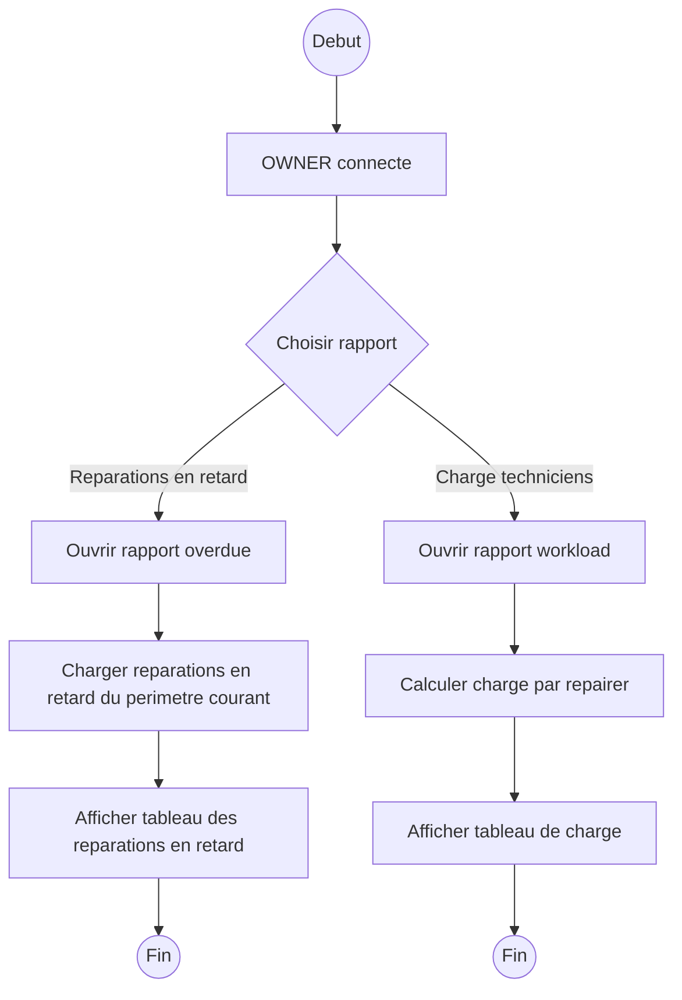
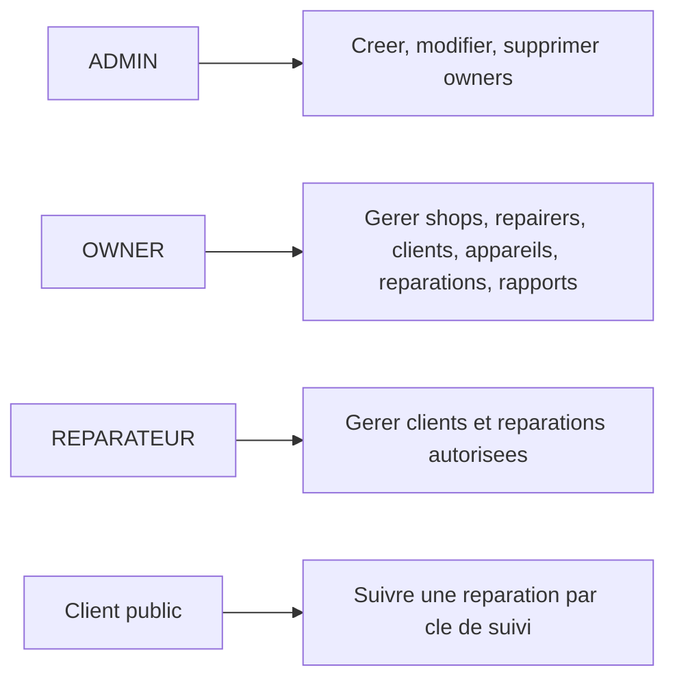

# Diagrammes d'activite - TheRepairShop

Ce document presente les principaux flux d'activite de l'application **TheRepairShop**.
Les diagrammes sont ecrits en Mermaid et peuvent etre affiches dans GitHub, GitLab,
IntelliJ, VS Code avec extension Mermaid, ou tout visualiseur compatible Mermaid.

---

## 1. Vue globale de l'application

```mermaid
flowchart TD
    start((Debut)) --> access[Acceder a l'application]
    access --> authCheck{Utilisateur authentifie ?}

    authCheck -- Non --> publicChoice{Action publique ?}
    publicChoice -- Suivre une reparation --> tracking[Rechercher avec la cle de suivi]
    tracking --> trackingResult{Cle valide ?}
    trackingResult -- Oui --> showTracking[Afficher l'etat de la reparation]
    trackingResult -- Non --> trackingError[Afficher une erreur]
    showTracking --> endPublic((Fin))
    trackingError --> endPublic

    publicChoice -- Connexion --> login[Afficher formulaire de connexion]
    login --> auth[Verifier identifiants]
    auth --> authResult{Identifiants valides ?}
    authResult -- Non --> loginError[Afficher erreur de connexion]
    loginError --> login
    authResult -- Oui --> roleRoute[Rediriger selon le role]

    authCheck -- Oui --> roleRoute

    roleRoute --> role{Role utilisateur}
    role -- ADMIN --> adminArea[Gestion des owners]
    role -- OWNER --> ownerArea[Gestion shops, repairers, clients, repairs, rapports]
    role -- REPARATEUR --> repairerArea[Gestion clients et reparations assignees]

    adminArea --> logout[Deconnexion]
    ownerArea --> logout
    repairerArea --> logout
    logout --> end((Fin))
```

---

## 2. Authentification et controle d'acces



---

## 3. Gestion des owners par ADMIN

```mermaid
flowchart TD
    start((Debut)) --> adminLogin[ADMIN connecte]
    adminLogin --> ownersList[Afficher liste des owners]
    ownersList --> action{Choisir une action}

    action -- Creer owner --> createForm[Afficher formulaire owner]
    createForm --> fillCreate[Saisir username, email, nom, prenom, telephone, password optionnel]
    fillCreate --> validateCreate{DTO valide ?}
    validateCreate -- Non --> showCreateErrors[Afficher erreurs de validation]
    showCreateErrors --> createForm
    validateCreate -- Oui --> checkUnique{Username/email disponibles ?}
    checkUnique -- Non --> showCreateErrors
    checkUnique -- Oui --> saveOwner[Creer owner + role OWNER]
    saveOwner --> showGenerated[Afficher mot de passe genere si besoin]
    showGenerated --> ownersList

    action -- Modifier owner --> editForm[Afficher formulaire edition]
    editForm --> fillEdit[Modifier email, profil, statut, nouveau password optionnel]
    fillEdit --> validateEdit{DTO valide ?}
    validateEdit -- Non --> showEditErrors[Afficher erreurs]
    showEditErrors --> editForm
    validateEdit -- Oui --> updateOwner[Mettre a jour owner]
    updateOwner --> ownersList

    action -- Reset password --> resetPassword[Generer nouveau mot de passe]
    resetPassword --> ownersList

    action -- Supprimer owner --> canDelete{Owner sans shops ?}
    canDelete -- Non --> deleteError[Afficher erreur]
    deleteError --> ownersList
    canDelete -- Oui --> deleteOwner[Supprimer owner]
    deleteOwner --> ownersList

    action -- Quitter --> end((Fin))
```

---

## 4. Gestion des repairers par OWNER

```mermaid
flowchart TD
    start((Debut)) --> ownerLogin[OWNER connecte]
    ownerLogin --> selectScope[Selectionner shop ou tous les shops]
    selectScope --> repairersList[Afficher repairers du perimetre courant]
    repairersList --> action{Choisir une action}

    action -- Creer repairer --> createForm[Afficher formulaire repairer]
    createForm --> fillCreate[Saisir username, email, nom, prenom, telephone, shop]
    fillCreate --> validateCreate{DTO valide ?}
    validateCreate -- Non --> createErrors[Afficher erreurs de validation]
    createErrors --> createForm
    validateCreate -- Oui --> shopAllowed{Shop dans le perimetre owner ?}
    shopAllowed -- Non --> createErrors
    shopAllowed -- Oui --> uniqueUser{Username/email disponibles ?}
    uniqueUser -- Non --> createErrors
    uniqueUser -- Oui --> saveRepairer[Creer repairer + role REPARATEUR + mot de passe genere]
    saveRepairer --> showPassword[Afficher mot de passe genere]
    showPassword --> repairersList

    action -- Modifier repairer --> editForm[Afficher formulaire edition]
    editForm --> fillEdit[Modifier email, profil, statut, shop]
    fillEdit --> validateEdit{DTO valide ?}
    validateEdit -- Non --> editErrors[Afficher erreurs]
    editErrors --> editForm
    validateEdit -- Oui --> accessAllowed{Repairer gere par owner ?}
    accessAllowed -- Non --> accessError[Afficher acces refuse]
    accessError --> repairersList
    accessAllowed -- Oui --> updateRepairer[Mettre a jour repairer]
    updateRepairer --> repairersList

    action -- Desactiver --> deactivate[Desactiver compte]
    deactivate --> repairersList

    action -- Reset password --> resetPassword[Generer nouveau mot de passe]
    resetPassword --> repairersList

    action -- Supprimer --> hasRepairs{Repairer a des reparations ?}
    hasRepairs -- Oui --> deleteError[Afficher erreur]
    deleteError --> repairersList
    hasRepairs -- Non --> deleteRepairer[Supprimer repairer]
    deleteRepairer --> repairersList

    action -- Quitter --> end((Fin))
```

---

## 5. Gestion client et appareils

```mermaid
flowchart TD
    start((Debut)) --> userLogin[OWNER ou REPARATEUR connecte]
    userLogin --> clientsList[Afficher liste des clients]
    clientsList --> action{Choisir une action}

    action -- Creer client --> clientForm[Remplir informations client]
    clientForm --> validateClient{Donnees valides ?}
    validateClient -- Non --> clientErrors[Afficher erreurs]
    clientErrors --> clientForm
    validateClient -- Oui --> saveClient[Enregistrer client + cle de suivi]
    saveClient --> clientsList

    action -- Voir client --> clientDetail[Afficher details client]
    clientDetail --> deviceAction{Action appareil}

    deviceAction -- Ajouter appareil --> deviceForm[Saisir marque, modele, type, serial, notes]
    deviceForm --> validateDevice{Donnees valides ?}
    validateDevice -- Non --> deviceErrors[Afficher erreurs]
    deviceErrors --> deviceForm
    validateDevice -- Oui --> saveDevice[Enregistrer appareil]
    saveDevice --> clientDetail

    deviceAction -- Modifier appareil --> editDevice[Modifier appareil]
    editDevice --> clientDetail

    deviceAction -- Supprimer appareil --> deleteDevice[Supprimer appareil]
    deleteDevice --> clientDetail

    action -- Modifier client --> editClient[Modifier informations client]
    editClient --> clientsList

    action -- Supprimer client --> deleteClient[Supprimer client]
    deleteClient --> clientsList

    action -- Quitter --> end((Fin))
```

---

## 6. Cycle de vie d'une reparation

```mermaid
flowchart TD
    start((Debut)) --> userLogin[OWNER ou REPARATEUR connecte]
    userLogin --> repairsList[Afficher liste des reparations]
    repairsList --> action{Choisir une action}

    action -- Nouvelle reparation --> newRepair[Selectionner appareil disponible]
    newRepair --> description[Saisir description du probleme]
    description --> validateRepair{Description valide ?}
    validateRepair -- Non --> repairError[Afficher erreur]
    repairError --> newRepair
    validateRepair -- Oui --> createRepair[Creer ticket avec statut PENDING]
    createRepair --> repairDetail[Afficher details de la reparation]

    action -- Voir details --> repairDetail

    repairDetail --> detailAction{Action sur la reparation}

    detailAction -- Assigner technicien --> assignForm[Selectionner repairer]
    assignForm --> assignAllowed{Technicien autorise ?}
    assignAllowed -- Non --> assignError[Afficher erreur]
    assignError --> repairDetail
    assignAllowed -- Oui --> assignRepair[Assigner technicien et passer en IN_PROGRESS]
    assignRepair --> addProgress1[Ajouter entree de progression]
    addProgress1 --> repairDetail

    detailAction -- Diagnostiquer --> diagnosisForm[Saisir diagnostic et cout final]
    diagnosisForm --> canDiagnose{Reparation en cours ?}
    canDiagnose -- Non --> diagnosisError[Afficher erreur]
    diagnosisError --> repairDetail
    canDiagnose -- Oui --> completeRepair[Enregistrer diagnostic et passer en COMPLETED]
    completeRepair --> addProgress2[Ajouter entree de progression]
    addProgress2 --> repairDetail

    detailAction -- Marquer retournee --> canReturn{Statut COMPLETED ?}
    canReturn -- Non --> returnError[Afficher erreur]
    returnError --> repairDetail
    canReturn -- Oui --> markReturned[Passer statut a RETURNED]
    markReturned --> addProgress3[Ajouter entree de progression]
    addProgress3 --> repairDetail

    detailAction -- Ajouter image --> uploadImage[Uploader image]
    uploadImage --> imageOk{Image valide ?}
    imageOk -- Non --> imageError[Afficher erreur]
    imageError --> repairDetail
    imageOk -- Oui --> saveImage[Stocker fichier et metadata]
    saveImage --> repairDetail

    detailAction -- Supprimer image --> deleteImage[Supprimer image]
    deleteImage --> repairDetail

    detailAction -- Retour liste --> repairsList
    action -- Quitter --> end((Fin))
```

---

## 7. Suivi public d'une reparation

```mermaid
flowchart TD
    start((Debut)) --> openTracking[Ouvrir page de suivi]
    openTracking --> enterKey[Saisir cle de suivi client]
    enterKey --> search[Rechercher client/reparation]
    search --> found{Cle trouvee ?}

    found -- Non --> showError[Afficher message introuvable]
    showError --> openTracking

    found -- Oui --> showInfo[Afficher client, appareil, statut et progression]
    showInfo --> status{Statut actuel}
    status -- PENDING --> pending[En attente]
    status -- IN_PROGRESS --> inProgress[En cours]
    status -- COMPLETED --> completed[Terminee]
    status -- RETURNED --> returned[Retournee au client]

    pending --> end((Fin))
    inProgress --> end
    completed --> end
    returned --> end
```

---

## 8. Rapports owner



---

## 9. Synthese des roles


