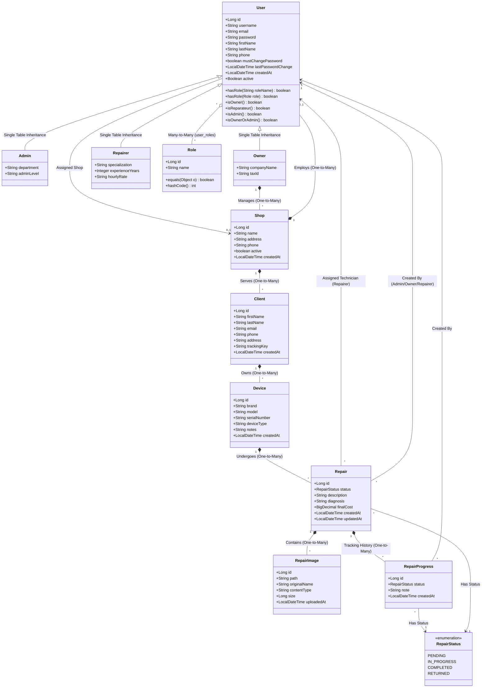
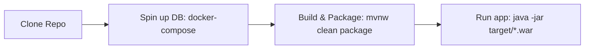

# Technical Architecture & Developer Onboarding Report

Welcome to the **TheRepairShop** technical architecture and developer onboarding guide. This document is designed to provide new developers with a deep understanding of the application's domain model, system architecture, core design trade-offs, and crucial implementation patterns.

---

## 1. Complete Class Diagram (Domain Entities)

The following Mermaid.js diagram illustrates the domain model of **TheRepairShop**. It details the core entities, their primary attributes, key helper methods, and their relationships/cardinalities.



### Domain Relationships Summary

1. **User Specialization & Inheritance**: The system models users with Single-Table Inheritance (STI). A `User` can be an `Admin`, an `Owner`, or a `Repairer` (Technician), marked by the `user_type` discriminator in the database.
2. **Access Control & Roles**: Users hold multiple roles (Many-to-Many relationship with `Role`) mapped via the `user_roles` join table.
3. **Multi-Shop Tenancy**: An `Owner` owns and manages multiple `Shops` (One-to-Many). Each `Shop` employs multiple `Users` (technicians/admins) and serves a specific cohort of `Clients`.
4. **Client & Asset Hierarchy**: A `Client` represents a customer associated with a specific `Shop`. Each Client owns multiple `Devices` (laptops, phones, etc.). A `Device` is the central physical asset undergoing a series of `Repairs`.
5. **Repair Tracking & Lifecycle**: Each `Repair` is created by a `User`, can be assigned to a specific `Repairer` (technician), and progresses through various statuses (`PENDING`, `IN_PROGRESS`, `COMPLETED`, `RETURNED`). The history of changes is tracked via `RepairProgress` entries, and physical conditions/proofs can be documented using `RepairImage` attachments.

---

## 2. System Design & Architectural Trade-offs

### The Architecture

**TheRepairShop** is built as a monolithic, server-side rendered Java web application using the **Model-View-Controller (MVC)** architectural pattern.

```
       +-------------------------------------------------------------+
       |                         Web Browser                         |
       |  (HTML / JSP Views / Bootstrap / Vanilla JS / CSS Styles)   |
       +---------------------------------------+---------------------+
                                               |
                                   HTTP Requests / Cookies
                                               |
                                               v
       +-------------------------------------------------------------+
       |                  Spring Boot MVC Monolith                   |
       |                                                             |
       |  +-------------------------------------------------------+  |
       |  |                   Controller Layer                    |  |
       |  |  (Interprets requests, coordinates views & bindings)  |  |
       |  +---------------------------+---------------------------+  |
       |                              |                              |
       |                              v                              |
       |  +-------------------------------------------------------+  |
       |  |                   Security Filters                    |  |
       |  |  (JwtAuthenticationFilter, ForcePasswordChangeFilter) |  |
       |  +---------------------------+---------------------------+  |
       |                              |                              |
       |                              v                              |
       |  +-------------------------------------------------------+  |
       |  |                     Service Layer                     |  |
       |  |  (Business Logic, Facade-Implementation decoupling)    |  |
       |  +---------------------------+---------------------------+  |
       |                              |                              |
       |                              v                              |
       |  +-------------------------------------------------------+  |
       |  |             Repository Layer (Spring Data)            |  |
       |  |  (JPA / Hibernate ORM mapping to MySQL engine)        |  |
       |  +---------------------------+---------------------------+  |
       |                              |                              |
       +------------------------------|------------------------------+
                                      |
                               Database Queries
                                      |
                                      v
                       +-----------------------------+
                       |       MySQL Database        |
                       | (Users, Shops, Devices...)  |
                       +-----------------------------+
```

* **Frontend**: Renders server-side JavaServer Pages (JSP) with JSTL tags, styled via vanilla CSS and Bootstrap. Interacts with the backend via traditional form submissions and asynchronous AJAX requests.
* **Security & Auth**: Uses a **Stateless JWT Cookie-based** approach. On successful login, a JSON Web Token (JWT) is stored as an HTTP-only secure cookie (`ACCESS_TOKEN`). Incoming requests are intercepted by a security filter chain (`JwtAuthenticationFilter`) that parses the cookie, validates the token, and sets the security context.
* **Backend Layers**:
  * **Controllers**: Bind form and query parameters, invoke business facades, and return logical view names resolved by the Spring MVC view resolver to `/WEB-INF/views/*.jsp`.
  * **Services**: Isolated via the **Facade Pattern**. Business interfaces (`facade` package) define operations, and the concrete implementation classes (`implementation` package) handle transaction boundary management and interact with the database.
  * **Repositories**: Leverage Spring Data JPA interface contracts mapped to MySQL.
* **Storage**: Local filesystem directories (`./uploads/repairs`) for persisting and serving uploaded device images.

---

### The Good Choices (Pros)

1. **Decoupled Business Layer via Facade Pattern**: The distinct segregation between Service Interfaces (Facades) and concrete Implementations protects the Controller layer from implementation details. If the underlying data source or service logic changes, the Controller contracts remain completely untouched, which speeds up feature delivery and refactoring.
2. **Single-Table Inheritance (STI) for Users**: Representing `Owner`, `Admin`, and `Repairer` within a single `users` table is exceptionally performant for read operations. It eliminates SQL joins across multiple tables when retrieving active users, simplifying JPA entity mappings and maintaining consistency easily.
3. **Stateless Security in a Cookie**: By storing a JWT inside an HTTP-only cookie, the system avoids database sessions or Redis caches for session lookups. Additionally, setting the cookie as `HttpOnly` and `Secure` blocks client-side Javascript from reading the token, preventing common Cross-Site Scripting (XSS) session-hijacking attacks.
4. **Development Velocity & Standardized Tooling**: Standardizing on Maven, Spring Boot, and Docker Compose makes onboarding immediate. New developers can spin up a local MySQL instance with a single command and launch the app without complex environment configuration.

---

### The Bad Choices & Risks (Cons)

1. **JSP & Stateless JWT Mismatch (Architectural Hybrid Anti-Pattern)**: 
   Traditionally, JSP-based applications rely on stateful `HttpSession` mechanisms. The combination of stateless JWT token storage in cookies with JSP pages requires custom security handlers, custom filters, and manually mapping claims into Thymeleaf/JSP view models. This complicates the security layer compared to an industry-standard Stateful Session Monolith or a decoupled Single Page Application (SPA) + REST API architecture.
2. **Local Disk Storage for File Uploads (Scale Bottleneck)**:
   Storing repair images on the local filesystem (`./uploads/repairs`) makes the application **stateful at the server level**. If traffic scales 100x and the app requires horizontal scaling (multiple instances behind an ALB/Nginx load balancer), requests for images will fail unless a sticky session or shared NFS is used, which are complex and fragile to maintain. It also poses risks of running out of server disk space.
3. **Severe N+1 Query Vulnerabilities**:
   Entities heavily utilize lazy loading (e.g., `Repair -> progressHistory` or `Device -> repairs`). When listing repairs on the dashboard or search lists, retrieving the status notes or progress history elements sequentially causes Hibernate to trigger an additional database query for *each* record. At scale, a single dashboard page load could trigger hundreds of SQL queries, overloading the database connection pool.
4. **Lack of Query Pagination**:
   Critical domain endpoints (like listings for repairs, devices, or users) execute simple `findAll()` repository queries. As the business grows to thousands of active client devices and repairs, these queries will load massive object trees into the JVM memory heap, causing Garbage Collection pauses, high latency, and eventual Out-Of-Memory (OOM) crashes.

---

## 3. Developer "Need-to-Know" (Onboarding & Gotchas)

### Crucial Architectural Patterns

When working on this codebase, developers **must** strictly adhere to the following structural conventions:

* **Always Code to Interfaces (Facade Pattern)**:
  * Do **NOT** inject repositories directly into controllers.
  * Do **NOT** inject service implementation classes (`*ServiceImpl`) directly.
  * *Correction Flow*: Define the contract in `service/facade/MyService.java`, implement it in `service/implementation/MyServiceImpl.java`, and inject `MyService` into the controller.
* **Single-Table Inheritance Conventions**:
  * All common fields reside in `User.java`. Subclass-specific columns (like `specialization` in `Repairer` or `companyName` in `Owner`) must be kept **nullable** in both JPA mappings and DB schemas because other user types won't populate them.
  * Use `@DiscriminatorValue` on the subclasses (`ADMIN`, `OWNER`, `REPARATEUR`).
* **Stateless Authenticated Contexts**:
  * Obtain the current user via Spring Security's `SecurityContextHolder.getContext().getAuthentication().getPrincipal()`.
  * Ensure password change policies are respected: `ForcePasswordChangeFilter` redirects users with `mustChangePassword = true` to `/profile/change-password` before any other route is accessible.

---

### Setup & Deployment Flow



1. **Local Infrastructure Setup**:
   Ensure Docker is running and launch the MySQL container:
   ```bash
   docker-compose up -d
   ```
2. **Configuration Settings**:
   The application imports credentials and JWT keys from environment variables (see `.env` file). If none are defined, it defaults to:
   * URL: `jdbc:mysql://localhost:3306/repairshop_db`
   * User/Password: `repairshop` / `repairshop`
   * JWT Secret: `super-secret-key-that-is-at-least-256-bits-long-and-highly-secure-for-hmac-sha-algorithms`
3. **Database Initialization**:
   Spring Boot runs `schema.sql` followed by `data.sql` at startup (`spring.sql.init.mode=always`). If you modify entity structures, ensure these files are updated accordingly to keep local environments in sync with Jpa validation.
4. **Execution**:
   Run the embedded Tomcat servlet engine via Maven:
   ```bash
   ./mvnw spring-boot:run
   ```
   Open your browser and navigate to `http://localhost:8080/`.

---

### Hidden Complexity ("Gotchas" & Common Pitfalls)

> [!WARNING]
> **Dynamic Typecasting & Hibernate Proxy Pitfalls**
> Because users utilize Single-Table Inheritance, Hibernate sometimes returns dynamic runtime proxies (e.g. `User$HibernateProxy`) instead of the true concrete class. Standard Java `instanceof` checks (like `user instanceof Repairer`) may fail unexpectedly in transactional scopes! 
> * **Best Practice**: Use the helper methods defined on the `User` base class (`isOwner()`, `isReparateur()`, `isAdmin()`) or inspect role collections directly instead of relying on `instanceof` casts.

> [!IMPORTANT]
> **Short JWT Expirations & Request Lifecycles**
> The `app.jwt.expiration-ms` is configured by default to **300,000 milliseconds (5 minutes)**. If you are debugging a feature locally and suddenly receive HTTP 403 Forbidden or get redirected to the login page, it is highly likely that your JWT cookie expired. For local developer convenience, you can increase this value in your environment or `application.properties`.

> [!CAUTION]
> **File Deletions and Broken Paths**
> When removing a `RepairImage` entry from the database, the physical image file stored in `./uploads/repairs` is **not** automatically deleted by JPA cascading. Developers must manually delete the physical file via `FileStorageService` during database deletion to prevent disk space leaks and orphaned server files.
