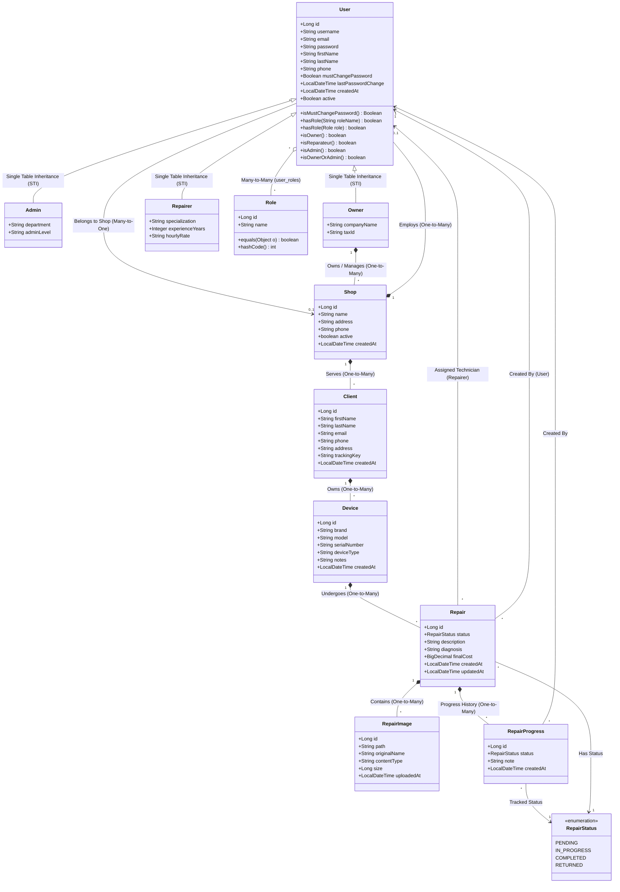
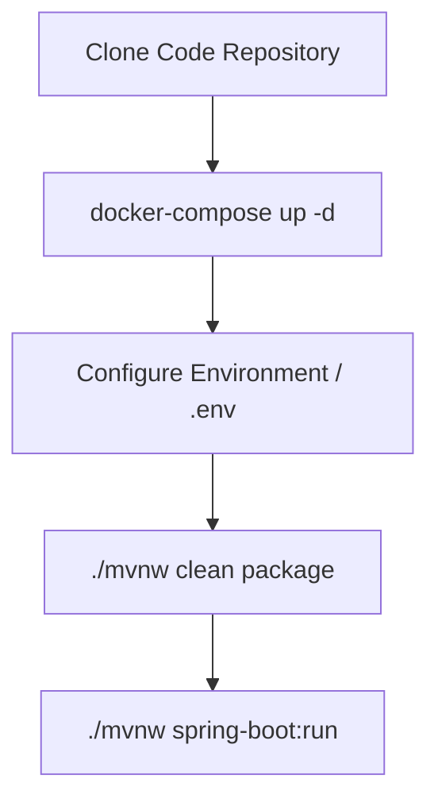

# Technical Architecture & Developer Onboarding Report

Welcome to the **TheRepairShop** technical architecture and developer onboarding guide. This document provides a detailed overview of the application's domain model, system design, architectural trade-offs, and critical developer guidelines.

---

## 1. Complete Class Diagram (Domain Entities)

The following Mermaid.js diagram illustrates the domain model of **TheRepairShop**. It details the core entities, their primary attributes, key helper methods, and their relationships/cardinalities.



### Domain Relationships Summary

1. **User Inheritance Model**: The domain models users using **Single-Table Inheritance (STI)** on the `users` table, with `user_type` acting as the discriminator column (`ADMIN`, `OWNER`, `REPARATEUR`). This represents a clean hierarchy where `Admin`, `Owner`, and `Repairer` inherit base features from `User` while adding role-specific attributes.
2. **Access & Security Mapping**: Access rights are handled via a Many-to-Many relationship between `User` and `Role` (joined in the `user_roles` table). This separation of concerns allows developers to manage standard Spring Security role declarations (`ROLE_ADMIN`, `ROLE_OWNER`, `ROLE_REPARATEUR`) dynamically.
3. **Tenant & Operational Boundaries**: An `Owner` operates one or many `Shops`. Each `Shop` represents an isolated operational center. The `Shop` contains a list of employee `Users` and serves a set of registered `Clients`.
4. **Client-Device Assets**: A `Client` acts as the customer entity in the system. Each Client can register one or many `Devices` (the repair assets, categorized by brand, model, type, and serial number).
5. **Repair Lifecycles**: A `Device` undergoes a series of `Repairs`. Each `Repair` is initiated by a `User` (e.g., an Admin or Owner), assigned to a `Repairer` (Technician), and tracked using a state-transition model with `RepairStatus` (`PENDING`, `IN_PROGRESS`, `COMPLETED`, `RETURNED`). Any updates generate a `RepairProgress` audit trail, and physical device visual proof can be attached using `RepairImage` files.

---

## 2. System Design & Architectural Trade-offs

### The Architecture

**TheRepairShop** is constructed as a monolithic, server-side rendered (SSR) web application utilizing the **Model-View-Controller (MVC)** architectural pattern, built on Spring Boot 3.x/4.x and Java 21.

```
       +-------------------------------------------------------------+
       |                         Web Browser                         |
       |  (HTML / JSP Views / Bootstrap / Vanilla JS / CSS Styles)   |
       +---------------------------------------+---------------------+
                                               |
                                    HTTP Requests / JSESSIONID
                                               |
                                                v
       +-------------------------------------------------------------+
       |                  Spring Boot MVC Monolith                   |
       |                                                             |
       |  +-------------------------------------------------------+  |
       |  |                   Controller Layer                    |  |
       |  |  (Handles web routes, redirects, view mapping & forms)|  |
       |  +---------------------------+---------------------------+  |
       |                              |                              |
       |                              v                              |
       |  +-------------------------------------------------------+  |
       |  |             Spring Security Filter Chain              |  |
       |  |  (ForcePasswordChangeFilter, CSRF verification...)    |  |
       |  +---------------------------+---------------------------+  |
       |                              |                              |
       |                              v                              |
       |  +-------------------------------------------------------+  |
       |  |               Service Layer (Facade)                  |  |
       |  |  (Business interfaces decoupled from implementations) |  |
       |  +---------------------------+---------------------------+  |
       |                              |                              |
       |                              v                              |
       |  +-------------------------------------------------------+  |
       |  |             Repository Layer (Spring Data)            |  |
       |  |  (JPA / Hibernate ORM mapping to MySQL database)      |  |
       |  +---------------------------+---------------------------+  |
       |                              |                              |
       +------------------------------|------------------------------+
                                      |
                                Database Queries
                                      |
                                      v
                        +-----------------------------+
                        |       MySQL Database        |
                        | (Users, Shops, Devices...)  |
                        +-----------------------------+
```

* **Frontend Engine**: Uses server-side JavaServer Pages (JSP) with JSTL and Spring Security tag libraries. The interface is styled using Bootstrap and vanilla CSS, creating standard form actions and visual views.
* **Security & Session Lifecycle**: Employs standard, secure **Stateful Cookie-based Spring Security Session Authentication**. Upon authentication, Spring assigns a unique, HTTP-Only session identifier (`JSESSIONID`). CSRF protection is fully active on all POST/PUT/DELETE operations.
* **Backend Layers**:
  * **Controllers**: Bind incoming HTTP requests, coordinate domain data mappings, and yield logical view strings mapped to target JSP files in `/WEB-INF/views/*.jsp`.
  * **Business Facades**: Implements the **Facade Pattern**. Controllers speak strictly to the Service Interfaces (located in `service/facade`), while the underlying transaction bindings and persistence logic are isolated in `service/implementation`.
  * **Data Repositories**: Leverages Spring Data JPA interfaces connected to the Hibernate ORM layer.
* **Database & Seed Storage**: MySQL runs on standard port `3306`. The schema structure is validated using `validate` configs, with automated base data imports coming from `schema.sql` and `data.sql` files at runtime. Physical files uploaded for repair tasks are stored inside local paths defined in `app.upload.dir`.

---

### The Good Choices (Pros)

1. **Standard Stateful Session Auth & Full CSRF Protection**: Moving to traditional cookie-based Spring Security Session Authentication is highly secure and standard for JSP architectures. CSRF protection is enabled out of the box, mitigating Cross-Site Request Forgery vulnerabilities. Since session management is handled natively by Spring and Tomcat, developers don't need custom filters or storage parsing scripts for JWTs.
2. **Decoupled Facade Pattern**: Separating Service Interfaces (Facades) from their concrete implementations represents a gold standard in clean architecture. This allows database persistence structures or external service dependencies to be modified easily under the hood without breaking controller method signatures or view mapping logic.
3. **Highly Efficient Single-Table Inheritance (STI)**: Modeling the `User` types (`Admin`, `Owner`, `Repairer`) in a single DB table optimizes reads. Checking authentications, loading user roles, or populating list details doesn't require slow database joins across tables. This simplifies the JPA architecture significantly.
4. **Immediate Local Environment Synchronization**: Standardizing properties with `spring.sql.init.mode=always` ensures that local databases run migrations instantly on startup. Developers can clone, execute `docker-compose up -d`, and run the app immediately, reducing setup overhead.

---

### The Bad Choices & Risks (Cons)

1. **Monolithic Scaling Bottleneck (Stateful Server Nodes)**:
   Because the system relies on local HTTP session storage via `JSESSIONID`, horizontal scaling is limited. At 100x traffic scaling, placing multiple application nodes behind a load balancer will result in session losses unless sticky-session load balancing is used, or a session-sharing database/cache (such as Spring Session with Redis) is introduced.
2. **Stateful Local File Storage**:
   Uploaded device repair images are saved directly on the local storage disk (`./uploads/repairs`). This binds the application state to a single physical disk. Scaling the application across multiple container nodes would require shared storage solutions (like AWS S3 or shared NFS partitions) to avoid image loading failures.
3. **N+1 Database Query Risks**:
   Relationships like `Repair -> progressHistory` or `Device -> repairs` use Hibernate lazy loading. When loading a massive list of repairs, fetching progress notes will trigger separate SQL calls for each row (the N+1 query pattern). Under high-volume concurrency, this could easily lock the thread pool or exhaust the database connections.
4. **Lack of Complete Pagination**:
   Although client lists support paging, other core tables like repairs, shops, and user management endpoints fetch records with `findAll()` calls. As the business database grows, these queries will load large numbers of JPA entities into memory, triggering major JVM Garbage Collection freezes or Out-of-Memory (OOM) crashes.

---

## 3. Developer "Need-to-Know" (Onboarding & Gotchas)

### Crucial Architectural Patterns

To maintain a clean and maintainable codebase, all new development must strictly adhere to the following patterns:

* **Strict Facade Injection Rule**:
  * Do **NOT** inject repository classes directly inside controllers.
  * Do **NOT** inject concrete classes (like `*ServiceImpl`) inside controllers.
  * *Correction Flow*: Declare the business method in `service/facade/MyService.java`, write the implementation logic in `service/implementation/MyServiceImpl.java`, and then wire the interface type (`MyService`) inside your target Controller.
* **Single-Table Inheritance Schemas**:
  * All common user parameters reside in the parent `User.java` file.
  * Subclass-specific properties (e.g., `specialization` in `Repairer` or `companyName` in `Owner`) **must** be nullable in both the database schema and Hibernate entity settings. Other user types (like Admins) will leave these properties null.
* **CSRF Token Insertion**:
  * Because Spring Security CSRF protection is active, all POST, PUT, and DELETE forms inside JSP views must include the CSRF token parameter. Failure to include this token will result in HTTP 403 Forbidden errors.
  * Include the following block in your form templates:
    ```html
    <input type="hidden" name="${_csrf.parameterName}" value="${_csrf.token}"/>
    ```

---

### Setup & Deployment Flow



1. **Spin Up Local Infrastructure**:
   Ensure Docker is active, then execute:
   ```bash
   docker-compose up -d
   ```
   This will spin up a local MySQL instance configured with the necessary database schemes and user credentials.
2. **Environment & App Credentials**:
   The database configuration properties in `application.properties` default to:
   * JDBC URL: `jdbc:mysql://localhost:3306/repairshop_db`
   * Database User/Password: `repairshop` / `repairshop`
   * App Server Port: `8080`
3. **Database Initialization**:
   Spring Boot automatically runs the `schema.sql` and `data.sql` seed templates during initialization because of the `spring.sql.init.mode=always` setup. This keeps local tables and roles in complete harmony with Java entities.
4. **Build & Execute**:
   Execute the Maven wrapper script to compile and run the application locally:
   ```bash
   ./mvnw spring-boot:run
   ```
   Navigate your web browser to: `http://localhost:8080/` to test.

---

### Hidden Complexity ("Gotchas" & Common Pitfalls)

> [!WARNING]
> **Hibernate Proxy vs Dynamic Instanceof Casts**
> When dealing with Single-Table Inheritance, Hibernate sometimes returns dynamic runtime proxies (e.g. `User$HibernateProxy`) instead of the true concrete Java class. Standard Java `instanceof` checks (like `user instanceof Repairer`) may fail unexpectedly inside transactional boundaries!
> * **Best Practice**: Always check roles via `user.isOwner()`, `user.isReparateur()`, or `user.isAdmin()`, or check authorities directly rather than relying on standard `instanceof` class conversions.

> [!IMPORTANT]
> **Permitted Routes & Force Password Change Filter**
> The `ForcePasswordChangeFilter` intercepts all authenticated requests. If a user is marked with `mustChangePassword = true`, they are automatically redirected to `/profile/change-password`.
> * **Onboarding Hazard**: If you declare a new API endpoint, view route, or resource dependency, and users with pending password updates face infinite redirection loops, it is because your new route is missing from the filter's exclusion check. Ensure you register new static paths inside `ForcePasswordChangeFilter.isAllowedPath()`.

> [!CAUTION]
> **Orphaned File Storage Leakages**
> Deleting a `RepairImage` row from the database using JPA cascade mechanisms will **not** remove the physical image file stored inside the upload path `./uploads/repairs`.
> * **Avoid Disk Leakage**: Developers must invoke `FileStorageService.deleteFile(path)` manually inside their repair deletion logic to prevent orphaned visual assets from permanently leaking server disk space.
